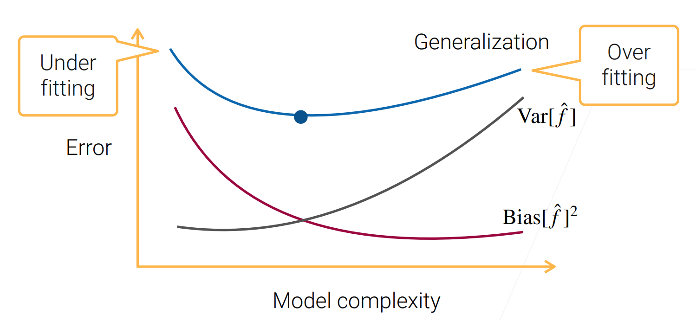

# Bias-Variance

## Bias-Variance Decomposition

* Sample data $D=\{(x_1, y_1), ..., (X_n, y_n)\}$ from $y=f(x)+\varepsilon$
* Learn $\hat f_D$ from data $D$ by minimizing MSE: $\min_{\hat f_D}\sum_{(x_i, y_i)\in D}(y_i-\hat f_D(x_i))^2$
* Evaluate generalization error $(y-\hat f_D(x))^2$ on a new data point $(x, y)$
$$E_D[(y-\hat f_D(x))^2]=E_D[((f-E_D[\hat f_D])-(\hat f_D-E_D[\hat f_D]))+\varepsilon)^2]$$
$(f-E_D[\hat f_D])$ is not a random variable, so
$$E_D[(y-\hat f_D(x))^2]=(f-E_D[\hat f_D])^2+E[(\hat f-E[\hat f]))^2]+E[\varepsilon^2]\\=Bias[\hat f]^2+Var[\hat f]+\sigma^2$$

* Reduce bias
  * A more complex model
  * Boosting
  * Stacking
* Reduce variance
  * A simpler model
  * Regularization
  * Bagging
  * Stacking
* Reduce $\sigma^2$
  * Improve data

### 待验证的想法

* 模型参数求解问题是一个优化问题，当模型复杂程度高的时候，参数解空间就大，针对训练集的等价解就多，就更难找到一组针对新数据的解，导致在训练集上性能好，泛化性能差。
